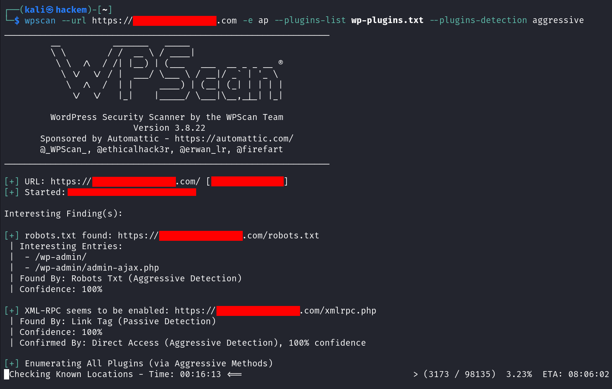

# wordpress-plugins-themes-wordlists

WordPress Plugins and Themes Wordlists for **Ethical Hacking &amp; Penetration Testing Purposes Only**.

These wordlists can be useful when doing **enumeration** and **reconnaissance** with tools like **wpscan** or **nuclei**.

## Nuclei

1. The nuclei's template (`wordpress-plugins-detect.yaml`) and the wordlist (`wp-plugins.txt`) **MUST** be on the same folder.

2. Run the following command on the folder where the wordlist and the template were located:

```bash
nuclei -u https://your-target-site.com -itags fuzz -t wordpress-plugins-detect.yaml
```

The output should be similar to the following picture:


## WPScan

1. Run the following command on the folder where the wordlist was located:

```bash
wpscan --url https://your-target-site.com -e ap --plugins-list wp-plugins.txt --plugins-detection aggressive
```

The output should be similar to the following picture:




## Wordlists Revisions:
- **WordPress Plugins:**
   - Number of Plugins in the Wordlist: 98.134
   - Revision: 2858740
   - Last Update: 02-Feb-2023
   - Source: http://plugins.svn.wordpress.org
- **WordPress Themes:**
   - Number of Themes in the Wordlist: 24.433
   - Revision: 2858740
   - Last Update: 02-Feb-2023
   - Source: http://themes.svn.wordpress.org

## Advantages:
- Both wordlists contain a vast number of plugins / themes respectively some of which don't appear on [WordPress Plugin Portal](https://wordpress.org/plugins/). Which makes them really helpful for reconnaissance and enumeration.
- Wordlists will be updated from time to time to maintain them as a useful resource for scanning tools.
- Both wordlists are directly extracted automatically from WordPress SVN Servers. This means not a single line was removed from the results (including the ones with special characters).
